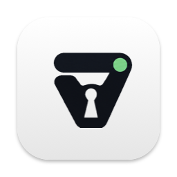

<p align="center">
  
</p>

<h1 align="center">Varlatch for macOS</h1>

<p align="center">
  Your <a href="https://github.com/varlatch/varlatch">Varlatch</a> sessions in the macOS menu bar:
  which servers you are signed in to, and when each credential expires.
</p>

<p align="center">
  <a href="LICENSE"></a>
</p>

Everything it shows comes from `varlatch status --json`, which reads local
files only. Needs macOS 13 or newer and the `varlatch` CLI.

## What it shows

The Varlatch mark in the menu bar, in the system's own monochrome, with a
small badge when something needs attention:

- **no badge:** every session is live
- **amber:** less than 20% of a credential's lifetime remains
- **red:** signed out, a credential has expired, or the CLI cannot be used
  (the mark is dimmed then)

A click opens a panel with one row per server and a live countdown
("Logged in, 3h 12m left"), or what stands in the way: no CLI, a CLI too
old for `varlatch status`, or its error. Hovering the icon shows the same
in a tooltip.

Each row has **Renew** (or **Log In** once expired) and a menu with **Open
Dashboard**, **Copy Address**, and **Log Out**. Above them, **Verify**
checks every stored credential with its server (`varlatch status --probe`)
and puts the result on its row, and **Dashboard** opens your server in the
browser. After a full logout, **Log In** still targets the last server you
used.

Signing in needs no terminal window. The CLI opens your browser for the
passkey prompt, and while it waits the panel shows "Signing in to …" with
**Open Link**, for when the page opened in the wrong browser, and
**Cancel**. The result arrives as a notification. Renewing is signing in
again: the CLI revokes the credential it replaces only after the new one is
verified and saved, so a cancelled or failed sign-in never signs you out.
Quitting the app cancels a sign-in it started.

## First run

Without the `varlatch` CLI, the panel explains what it is for and offers
**Install in Terminal**, which opens Terminal and runs
`brew install varlatch/tap/varlatch` (the app picks the CLI up by itself
once it is there), or **Copy Command**. Without Homebrew, it points to
[brew.sh](https://brew.sh) first. The release CLI needs Node.js 22 or newer,
which the Homebrew formula brings along.

With the CLI but no server known yet, the panel asks for the server's
address (`varlatch.example.com`; `https://` is added when no scheme is
given), and **Connect** starts the browser sign-in. **Add Server** below
the sessions, or **Other Server** when logged out, opens the same form.

## Sign in from another device

When the browser on this Mac has no passkey for your server, sign in from
another device instead: **Other Device** on the panel while a sign-in waits,
**Sign In from Another Device** in a server's menu, or **Use Another
Device** on a failed sign-in's notification (the expiry notifications have
an **Another Device** button too). The panel shows an address, a code, and
a QR code of the address for a phone's camera. Open the address on any
device, sign in with your passkey, enter the code, and approve. The app
collects the new credential, and as with a browser sign-in, the CLI revokes
the credential it replaces only once the new one is saved. The code lasts
10 minutes. This needs Varlatch CLI 0.14.0 or newer; with an older CLI these
buttons do not show.

Moving into *expiring* or *expired* triggers one notification each, with
**Renew Now** or **Log In**. The app asks for permission to notify when it first starts; without it, it
works the same, just silently.

Servers on `localhost` or `127.*` are left out unless **Show localhost
servers** is on.

## Updates

With **Check for new CLI releases** on, the panel's footer shows when a
newer CLI release is out, with **Release Notes** and, for a CLI the app
knows how to update, **Update in Terminal**: `brew upgrade varlatch` for a
Homebrew CLI, `varlatch self-update` for the release build (Varlatch 0.11.0
and newer; it checks the download and asks before replacing anything). A
CLI built from a source checkout, or installed some other way, gets the
release notes. A new release also triggers one notification.

The app itself updates with Homebrew: `brew upgrade varlatch-menubar`.

## Privacy

The app runs `varlatch status --json` on a timer. That command reads
`~/.config/varlatch/credentials.json` and repository-local state; it makes
no network requests and never uses a stored credential. The app never reads
the credentials file itself. The only network requests are the ones you
start with a click (sign in, renew, verify, log out) and, with **Check for
new CLI releases** on, an anonymous request for the latest release to
GitHub's API, cached in
`~/Library/Application Support/com.varlatch.menubar/update.json`. That
check runs twice a day in the background, again when you open the panel and
the last one is over an hour old, and when the cache names an older release
than the CLI you have; never more than once an hour. The servers you used
are remembered in `servers.json` in the same directory.

## Settings

**Varlatch > Settings** (the gear in the panel), stored in the app's user
defaults (`defaults read com.varlatch.menubar`):

- **Open at login** (on): starts the app when you log in.
- **Session length** (the server's default, 12 hours): how long a new
  sign-in lasts, from 1 to 24 hours. Applies to every sign-in the app
  starts, renewals included.
- **Check sessions every** (30 seconds, at least 15).
- **Notify before a session expires** (on).
- **Show in the menu bar when logged out** (on). With it off, the icon
  disappears while no credentials are stored; open the app again (from
  Finder, Spotlight, or Launchpad) to get to Settings.
- **Show localhost servers** (off).
- **CLI path** (automatic): the CLI to run, for one installed somewhere
  else or a development build. **Choose…** picks the file.
- **Check for new CLI releases** (off).

## Finding the CLI

Apps opened from Finder do not get your shell's `PATH`, so the app looks
for `varlatch` in `/opt/homebrew/bin`, `/usr/local/bin`, and
`~/.local/bin`, and runs it with those directories in front of the `PATH`,
so the release CLI finds `node` too.

## Opening at login

Installed with Homebrew, the app runs from a versioned directory that
`brew upgrade` replaces, so it opens at login through a LaunchAgent
(`~/Library/LaunchAgents/com.varlatch.menubar.login.plist`) that opens
Homebrew's stable `opt` link. Installed anywhere else, it is a regular
login item. Either way, it shows as "Varlatch" in **System Settings >
General > Login Items & Extensions**, and **Open at login** turns it off.

## Building

Needs Apple's Command Line Tools (`xcode-select --install`); Xcode is not
required.

```bash
scripts/bundle.sh          # builds build/Varlatch.app, signed ad hoc
open build/Varlatch.app
```

`scripts/bundle.sh --version 1.2.3` sets the app's version (default: the
latest `v*` tag). Options after `--` go to `swift build`.

## Development

- `Sources/VarlatchKit`: the logic (finding and running the CLI, reading
  its status, the expiry rules), testable without a window server.
- `Sources/Varlatch`: the SwiftUI app.
- `scripts/test.sh` runs the tests (Swift Testing), with Xcode or the
  Command Line Tools.
- `Tests/fake-varlatch` stands in for the CLI, in the tests and for trying
  the app without a server: point **CLI path** at it
  (`defaults write com.varlatch.menubar cliPath "$PWD/Tests/fake-varlatch"`)
  and give it a directory with a `status.json` in `FAKE_VARLATCH_DIR`. See
  the script for the rest.
- `swift scripts/make-icons.swift` makes the icons in `Resources/` from the
  marks in `assets/`.

To check the running app without clicking through it, turn on its debug
hooks and open it again:

```bash
defaults write com.varlatch.menubar debugHooks -bool true
```

It then keeps its state in
`~/Library/Application Support/com.varlatch.menubar/debug-state.json` and
answers `notifyutil -p com.varlatch.menubar.debug.<name>`, where `<name>` is
`dump-state`, `open-panel`, `settings`, `refresh`, `sign-in`, `device`,
`cancel`, `verify`, `logout`, `quit`, `check-releases`, or `install-cli`
(the actions use the first server shown).

See [`CHANGELOG.md`](CHANGELOG.md) for what changed in each release.

## License

Copyright © 2026 Robotsson. Licensed under the Apache License 2.0; see
[`LICENSE`](LICENSE).
